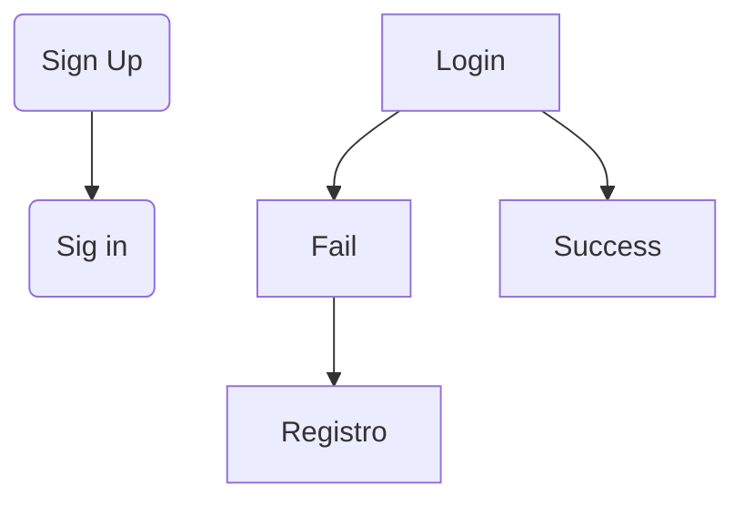

# Toma de requerimientos de un proyecto

<<[...] la toma de requerimientos se define como un proceso enfocado en el usuario y sus necesidades, en donde cada una de sus etapas influyen en la obtención de documentos representativos para el proyecto y las necesidades reales de los usuarios, depuradas en base a procesos que se llevan a cabo en el desarrollo del software.>>

Lozano, Y. A. (2021). *Guía met Guía metodológica par odológica para la toma de r oma de requerimient equerimientos en sistemas os en sistemas de información aplicando la norma IREB INTERNATIONAL REQUIREMENTS ENGINEERING BOARD.* https://ciencia.lasalle.edu.co/cgi/viewcontent.cgi?article=2066&context=sistemas_informacion_documentacion#:~:text=As%C3%AD%20las%20cosas%2C%20la%20toma,llevan%20a%20cabo%20en%20el
## FASES REQUERIMIENTO DE SOFTWARE

1.  [DESCRIPCION GENERAL DEL REQUERIMIENTO](#descripcion-general-del-requerimiento)
3.  [FASE DE FORMALIZACIÓN](#fase-de-formalización)
4.  [ANALISIS DE REQUISITOS Y REQUERIMIENTOS](#analisis-de-requisitos-y-requerimientos)
5.  LEVANTAMIENTO DEL REQUERIMIENTO DETALLADO
6.  DISEÑO DE LA ARQUITECTURA DE SOLUCION

> Caso **Abogabot**

*   Es un despacho de abogados que quiere automatizar las demandas de sus clientes, esto lo harán a traves de una página web llenando un formulario.
*   Al momento de llenar el formulario se manda al proceso de pago para finalizar la transacción.
*   Para dar seguimiento a su demanda, el cliente crea una cuenta en la plataforma y verá el seguimiento de cada una de las actualizaciones del proceso legal.
*   El administrador del sitio recibe la notificación de una nueva demanda y con los datos llenados del formulario se crea automaticamente el documento legal en formato word para empezar el proceso.
*   El administrador recibe el pago y debe de ser capaz de verlo en un dashboard para ver la cantidad de ingresos recibidos.
*   El administrador actualiza el proceso de la demanda y agrega comentarios en cada paso del proceso.
*   Al usuario le llegan correos de notificación para saber el avance de su proceso.
*   La página debe de ser responsive para poderla ver desde el celular.
*   La preferncia de colores del cliente es azul marino y blanco, pero acepta propuestas.

|   Logo propuesto||  
| ---: | :---: |
|||

Estas imagenes son tomadas de internet con fines ilustación y aprotación a la práctica

##### DESCRIPCION GENERAL DEL REQUERIMIENTO
|||
| :-- | :-- |
|   PROYECTO |	Abogabot |
|   Nombre Requerimiento: |    Automatización de damandas   |
|   Fecha Solicitud:    |	DD/MM//AAAA |
|   Responsable(s) Solicitud:   |   Gustavo Adolfo Camacho  |
|   Dependencia(s) Solicitante: |	Demanda  |
|   Responsable Funcional designado por el equipo de desarrollo de software:    |	Jonathan Alejandro Hernandez Flores  |

##### Fase de formalización

| 
 Descripción de la solicitud |
|:--------------------------------------|
| __Usuario solicitante__               |
| 
 Se requiere crear una página web donde el solicitante tenga que registrarse; tras rellenar un formulario con los datos necesarios para levantar acta (se generara un documento Word con los datos del cliente) deberá realizarse un pago; el pago deberá verse reflejado del lado del administrador, una vez que el administrador confirme el pago el usuario será notificado por medio de correo electrónico que su caso está siendo atendido (los correros llegaran de forma periódica para mantener informado al cliente); así mismo el cliente también podrá dar seguimiento a través del portal donde podrá interactuar por medio de comentarios por parte del abogado asignado. 
 |
| __Lider funcional__ |
| 
 Se diseñara un aplicación web donde el usuario se registrara; podrá iniciar sesión, rellenar un formulario, hacer pago por un servicio, una vez echo el pago y verificado por él administrador se generara de forma automática un documento Word con el formato que el despacho haya dado y contendrá los datos de usuario, el caso se le será asignado a un abogado que se encuentre dentro de la base datos y, él abogado será notificado de su asignación por medio de correo electrónico (este correo contendrá el documento del cliente. El abogado iniciará sesión en la aplicación para actualizar el seguimiento del caso y añadir comentarios, una vez el abogado termine sus actividades, el usuario será notificado por medio de correo electrónico del estado de su caso. Herramientas a usar: HTML5, SCSS, Node, React, javascrip, mysql… 
 |

| 
 __FIRMAS DE ACEPTACIÓN:__ 
 ||
|:--:| :--:|
|_|
|Nombre Responsable Solicitud Dependencia Solicitante| Nombre Líder OTI Oficina Tecnologías de la Información|

##### ANALISIS DE REQUISITOS Y REQUERIMIENTOS 

